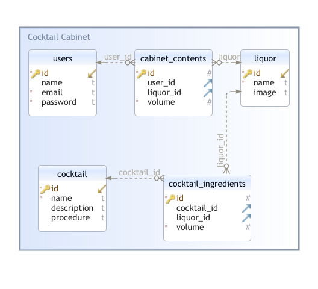

# Cocktail Cabinet

## Intro
Enjoying mixed drinks at the bar is fun, but making your cocktails at home is priceless!
You do not have to be a professional bartender to make delicious cocktails at home.

**What liquors do you have?**
This app shows you cocktail recipes based on the available liquor in your alcohol cabinet.

**How does it work?**
1. You need to signup in this link https://hidden-inlet-61020.herokuapp.com/
2. After logged in, you setup your cabinet by adding alcohol
3. Then click on `Get Me Drunk` button.

**Voila!**

You can see cocktails and recipes that you can make with the alcohol that you have in your cabinet.
If you decide to choose that cocktail the alcohol volumes will be automatically updated in your cabibet.

## Functionality
- [x] User can Sign-up/Login.
- [x] User enters/loads all the bottles of liquor and volumes that are available in the alcohol cabinet
- [x] User requests recipes for the available alcohol
    - [x] API returns all recipes, ingredients with volumes, and procedure
- [x] User selects the cocktail recipe
    - [x] The liquor volumes are automatically updated in the alcohol cabinet.
- [x] User can remove bottles of liquor from the cabinet
- [x] User can update the volumes of the liquor in the cabinet
- [ ] User can save cocktails as favorite.
- [x] User can Sign-out/Logout, 

## Use Case
This Use Case Diagram is graphically showing user's possible interactions with Cocktail Cabinet Application.

## Data Base
This Database Diagram is graphically showing the structure of the Cocktail Cabinet database and relations between database objects.

## Built With
- Javascript
- Node.js.
- PostgreSQL.
- Hosted by Heroku.
- Bcrypt for password-hashing.

## Knowledge Acquisition
Mistakes and solutions.

## Engineers
- Alvin
- Eugene Levin
- Vinicius - 1viniciusprado@gmail.com

**Project URL:** https://github.com/elevin-bot/cocktailCabinet

**Application URL:** https://hidden-inlet-61020.herokuapp.com/

## Acknowledgments
Use this space to list resources you find helpful and would like to give credit to. I've included a few of my favorites to kick things off!
- https://generalassemb.ly/
